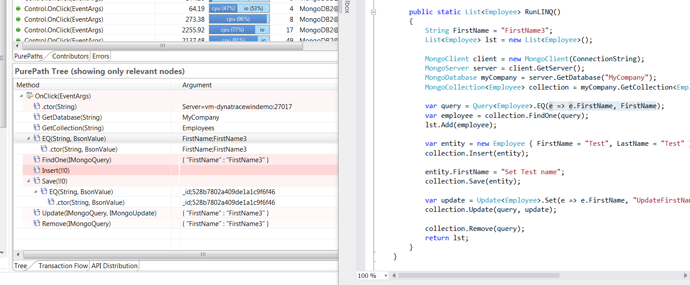

# MongoDB for .NET FastPack

This FastPack gives you visibility into the
MongoDB queriees executed by your .NET Application

| Name | MongoDB for .NET FastPack
| :--- | :---
| Author | MCG Systems
| Supported dynaTrace Version | >= 5.5
| License | [dynaTrace BSD](dynaTraceBSD.txt)
| Support | [Community](https://community.compuwareapm.com/community/display/DL/Support+Levels#SupportLevels-Community)
| Release history | Version 1.0
| Download | [com.mcg.diagnostics.knowledgesensor.MongoDBdotNet.dtcs](com.mcg.diagnostics.knowledgesensor.MongoDBdotNet.dtcs)
||[MongoDB.profile.xml](MongoDB.profile.xml)
||[MongoDB2_example_src.zip](MongoDB2_example_src.zip)
||[mongodb.dts](mongodb.dts)

## FastPack Information

This FastPack includes a [Sensor Pack](com.mcg.diagnostics.knowledgesensor.MongoDBdotNet.dtcs) that you can install on your dynaTrace Server and then use on your existing
System Profile. It defines additional Method Sensor Rules to pick up calls such as Insert, Save, Update, Remove or Find from the MongoDB Framework.

You can also use the [pre-configured System Profile](MongoDB.profile.xml) to get started with your own application. The System Profile defines the same rules as the Sensor
Pack.

## Installation

  1. Save the attached dtcs file locally to the computer where the dynaTrace Client is installed. 

  2. In the dynaTrace Client, choose _Setting ⇒ dynaTrace Server Settings_

  3. Click on "Sensor Packs". 

  4. Click on the "Import..." button. 

  5. Navigate to the directory where you extracted the .dtcs file and click "Open". 

## Sample Application and Session

If you want to test this out or see what data is captured by dynaTrace check out the [sample application](MongoDB2_example_src.zip) or import the sample [dynaTrace sessionfile](mongodb.dts).

## Screenshots

